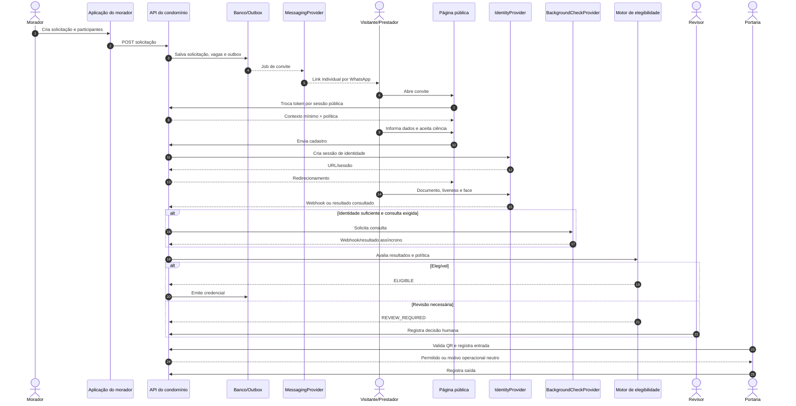
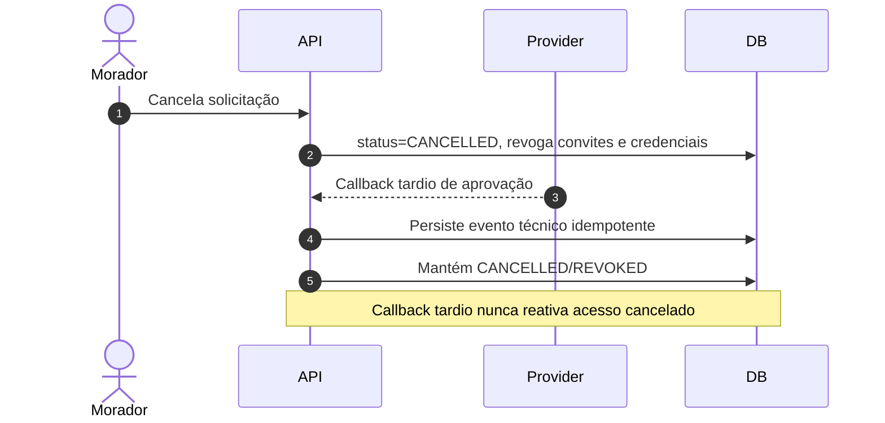
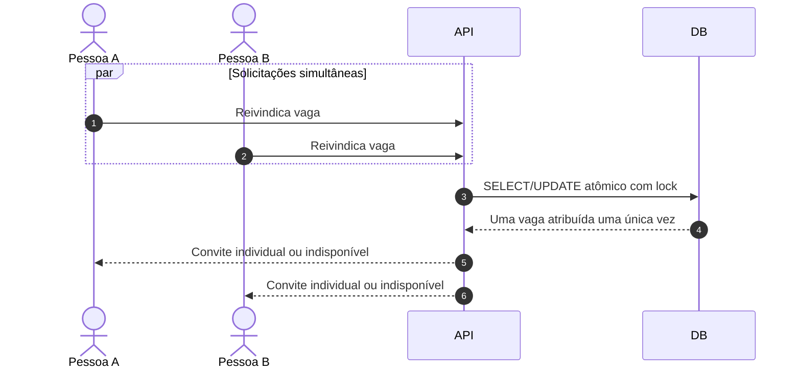
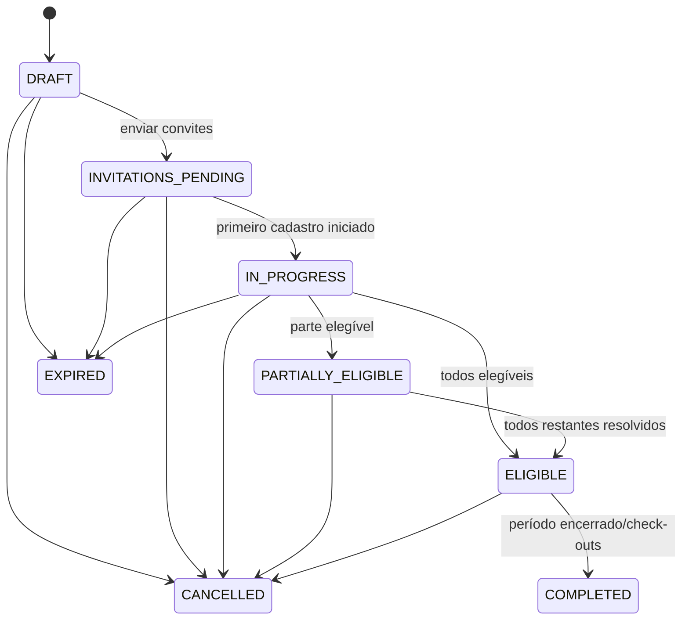

> **Documento canônico de especificação.**
>
> Para decisões posteriores sobre a Rede Confia, deduplicação entre condomínios,
> telefone compartilhado e proibição de auto-deny, `DECISIONS.md` tem precedência.
>
# Especificação Funcional e Técnica — Acesso Verificado para Visitantes e Prestadores

> **Documento de execução para Codex**
> **Status:** pronto para descoberta do repositório e implementação incremental
> **Versão:** 1.0
> **Data de referência:** 14 de julho de 2026
> **Domínio:** gestão condominial
> **Nome de produto recomendado:** **Acesso Verificado**

---

## 0. Como o Codex deve usar este documento

Este arquivo é a fonte de verdade funcional para a nova capacidade de visitantes e prestadores de serviço. Ele define o comportamento esperado do produto, regras de negócio, estados, integrações, requisitos de segurança, modelo conceitual, contratos de API, backlog e ordem de implementação.

Ele **não autoriza o Codex a inventar arquitetura, framework, estrutura de pastas ou padrões diferentes dos já existentes no repositório**.

### 0.1 Regra de precedência

Em caso de conflito:

1. Requisitos legais, de segurança e privacidade deste documento.
2. Regras funcionais e invariantes deste documento.
3. Convenções já consolidadas no repositório.
4. Preferências de implementação do Codex.

O Codex deve registrar conflitos antes de editar código.

### 0.2 Descoberta obrigatória antes da primeira alteração

Antes de criar ou alterar arquivos, o Codex deve inspecionar:

- `AGENTS.md` e arquivos equivalentes de instrução;
- `README`, documentação de arquitetura e ADRs;
- manifests de dependências;
- estrutura de módulos e padrões de domínio;
- autenticação e autorização;
- mecanismo de multi-tenancy;
- modelos de condomínio, unidade, morador e usuário;
- persistência, migrations, transações e naming;
- API, validação, serialização e tratamento de erros;
- filas, jobs, cron, eventos e outbox;
- cache, feature flags e configuração;
- storage e gestão de secrets;
- observabilidade e auditoria;
- testes unitários, integração, contrato e E2E;
- frontend, design system, rotas e formulários;
- integrações existentes de WhatsApp, SMS, e-mail, QR Code e portaria.

### 0.3 Entrega da descoberta

A primeira resposta do Codex deve conter, sem implementar a funcionalidade:

1. mapa resumido do repositório;
2. stack e versões relevantes;
3. módulos existentes que serão reutilizados;
4. convenções de código e testes;
5. mecanismo atual de tenant/condomínio;
6. modelo atual de morador, unidade e portaria;
7. integrações existentes aproveitáveis;
8. arquivos que provavelmente serão alterados ou criados;
9. divergências entre este documento e o código atual;
10. plano da fase solicitada;
11. riscos;
12. comandos de validação que serão executados.

Não criar um novo framework, ORM, sistema de filas, biblioteca de estado, camada de domínio ou mecanismo de autorização quando o projeto já possuir uma solução equivalente.

---

# 1. Visão do produto

## 1.1 Objetivo

Permitir que um morador solicite o acesso de:

- um ou vários visitantes;
- um ou vários prestadores de serviço;

e que cada pessoa conclua individualmente um fluxo de cadastro, validação de identidade e, quando autorizado pela política do condomínio, verificação de certidões ou outras fontes permitidas.

O fluxo termina com uma decisão auditável e uma credencial temporária para entrada no condomínio.

## 1.2 Proposta de valor

> Não apenas autorizar um nome. Confirmar, de forma proporcional e auditável, quem efetivamente está autorizado a entrar.

A jornada-alvo é:

```text
Solicitação do morador
        ↓
Participantes individuais
        ↓
Convite seguro por WhatsApp
        ↓
Autocadastro sem instalação de aplicativo
        ↓
Aviso de privacidade e coleta mínima
        ↓
Documento/CPF + prova de vida + comparação facial 1:1
        ↓
Consultas permitidas pela política
        ↓
Resultado normalizado e explicável
        ↓
Revisão humana quando necessário
        ↓
Credencial temporária
        ↓
Check-in e check-out na portaria
```

## 1.3 Princípio de linguagem

O produto **não** deve usar os termos:

- “scanner de integridade”;
- “pessoa íntegra”;
- “pessoa não íntegra”;
- “seguro” ou “perigoso” como classificação absoluta;
- score moral;
- “antecedente positivo” como sinônimo automático de impedimento;
- verde/vermelho sem explicação da fonte e da regra.

O sistema deve registrar fatos verificáveis, como:

- identidade validada;
- prova de vida inconclusiva;
- documento divergente;
- certidão negativa emitida;
- certidão não emitida;
- fonte indisponível;
- confirmação presencial necessária;
- revisão humana necessária;
- acesso elegível;
- acesso negado por decisão humana autorizada.

---

# 2. Escopo

## 2.1 Escopo do MVP

O MVP deve contemplar:

1. solicitação de visitantes;
2. solicitação de prestadores;
3. uma ou várias pessoas por solicitação;
4. data e horário inicial e final;
5. catálogo de tipos de serviço;
6. opção “Outros” com descrição obrigatória;
7. convite individual e seguro;
8. compartilhamento manual por WhatsApp;
9. adapter para envio automatizado por WhatsApp;
10. página pública responsiva;
11. cadastro individual sem instalar aplicativo;
12. aviso de privacidade versionado;
13. coleta mínima de dados;
14. validação de CPF e datas;
15. prova de vida;
16. comparação facial 1:1 com referência confiável;
17. validação documental ou em base confiável;
18. consulta de certidões configurada por política;
19. processamento assíncrono;
20. tratamento de homonímia e inconclusão;
21. revisão manual;
22. decisão versionada e auditável;
23. QR Code ou credencial opaca;
24. painel do morador;
25. painel da portaria;
26. check-in;
27. check-out;
28. cancelamento e revogação;
29. multi-tenancy;
30. criptografia, RBAC, auditoria, retenção e observabilidade;
31. adapters fake para todos os fornecedores;
32. feature flags por condomínio e ambiente.

## 2.2 Fora do MVP

Não faz parte da primeira entrega:

- integração física específica com catracas de um fabricante;
- cadastro nacional completo de empresas prestadoras;
- recorrência avançada de agenda;
- reaproveitamento de identidade entre condomínios;
- armazenamento local de templates biométricos;
- classificação criminal proprietária;
- decisão adversa totalmente automatizada;
- consulta direta à API do Conecta gov.br;
- consulta criminal de menores;
- cobertura automática de estrangeiros sem documento suportado;
- biometria própria desenvolvida internamente;
- reconhecimento facial 1:N para procurar pessoas em uma base;
- vigilância contínua por câmeras;
- análise de emoções, raça, gênero ou atributos não necessários.

Esses itens podem ser tratados em fases posteriores mediante decisão específica.

---

# 3. Atores e permissões

## 3.1 Atores

### Morador

Pode criar, consultar, alterar e cancelar solicitações vinculadas às unidades em que possui autorização.

### Participante

É a pessoa convidada: visitante ou trabalhador de uma empresa/prestador. Acessa somente o próprio convite.

### Porteiro ou operador de acesso

Consulta pessoas esperadas, valida credenciais, registra entrada e saída. Não acessa detalhes de certidões ou biometria.

### Administrador do condomínio

Configura catálogo, janelas, políticas operacionais e acompanha solicitações. O acesso a dados sensíveis depende de permissão adicional.

### Revisor de acesso sensível

Perfil separado, autorizado a analisar casos inconclusivos e tomar decisão humana.

### Operador da plataforma

Gerencia configuração técnica, providers, feature flags e incidentes. Não deve visualizar PII por padrão.

### Encarregado/jurídico

Aprova políticas de tratamento, retenção, fontes e critérios de decisão. Não é necessariamente um usuário operacional do sistema.

## 3.2 Matriz mínima de acesso

| Capacidade | Morador | Participante | Porteiro | Admin | Revisor | Plataforma |
|---|---:|---:|---:|---:|---:|---:|
| Criar solicitação | Sim | Não | Não | Sim | Não | Não |
| Ver andamento resumido | Sim | Próprio | Resumido | Sim | Sim | Técnico |
| Ver CPF completo | Não | Próprio | Não | Não por padrão | Somente necessidade | Não por padrão |
| Ver selfie/template | Não | Próprio durante captura | Não | Não | Não por padrão | Não |
| Ver resultado detalhado de fonte | Não | Próprio quando aplicável | Não | Não por padrão | Sim | Técnico sanitizado |
| Decidir caso inconclusivo | Não | Não | Não | Opcional por permissão | Sim | Não |
| Emitir/revogar credencial | Solicitada pelo fluxo | Não | Validar | Sim | Conforme decisão | Não |
| Check-in/check-out | Não | Não | Sim | Sim | Não | Não |
| Configurar providers | Não | Não | Não | Não | Não | Sim |
| Alterar política | Não | Não | Não | Sim, se autorizado | Não | Suporte técnico |

Toda autorização deve respeitar o tenant/condomínio e a unidade.

---

# 4. Conceitos de domínio

## 4.1 Solicitação de acesso

Agregado que representa uma autorização temporal criada por um morador ou administrador.

Tipos:

```text
VISITOR
SERVICE_PROVIDER
```

## 4.2 Participante

Pessoa individual vinculada a uma solicitação. Uma solicitação coletiva nunca substitui o cadastro individual.

## 4.3 Vaga

Posição reservada para um participante quando o morador informa apenas a quantidade e ainda não conhece todos os telefones.

## 4.4 Convite

Credencial temporária que permite iniciar o autocadastro público.

## 4.5 Pessoa

Registro deduplicável, protegido e restrito, usado para vincular identificadores pessoais a verificações. Não confundir com usuário autenticado da plataforma.

## 4.6 Verificação de identidade

Conjunto de evidências independentes:

- dados declarados;
- documento;
- prova de vida;
- comparação facial 1:1;
- validação em referência confiável;
- integridade técnica da sessão.

## 4.7 Verificação de antecedentes ou certidão

Consulta a uma fonte autorizada, com semântica e cobertura conhecidas. Não equivale a uma declaração de caráter.

## 4.8 Elegibilidade

Decisão operacional sobre aquele participante, para aquela solicitação, período, condomínio e versão de política.

## 4.9 Credencial de acesso

Token ou QR Code temporário, opaco e revogável. Não deve carregar PII legível.

## 4.10 Evento de acesso

Registro de check-in, check-out, tentativa rejeitada ou correção operacional.

---

# 5. Fluxos funcionais

## 5.1 Solicitação de visitante

1. O morador abre “Solicitar visitante”.
2. Seleciona a unidade quando possui mais de uma.
3. Informa quantidade de pessoas.
4. Informa início e fim da autorização.
5. Pode informar nome e telefone de cada pessoa.
6. O sistema cria uma vaga por participante.
7. Para telefones conhecidos, cria convite individual.
8. Para vagas sem telefone, cria mecanismo de reivindicação controlada.
9. O morador compartilha os convites por WhatsApp.
10. Cada participante conclui o cadastro individualmente.
11. O sistema executa as verificações exigidas pela política.
12. O morador acompanha somente status resumidos.
13. Participantes elegíveis recebem credencial.
14. A portaria valida a credencial e registra entrada.
15. A portaria registra saída.
16. Ao fim da janela, a autorização expira.

### Dados obrigatórios da solicitação de visitante

- condomínio;
- unidade;
- morador solicitante;
- quantidade;
- data/hora inicial;
- data/hora final;
- timezone do condomínio.

### Dados opcionais

- observação operacional;
- motivo da visita;
- nome inicial;
- telefone inicial.

## 5.2 Solicitação de prestador

1. O morador abre “Solicitar prestador de serviço”.
2. Seleciona a unidade.
3. Seleciona o tipo de serviço.
4. Caso selecione “Outros”, descreve o serviço.
5. Informa empresa ou profissional, quando conhecido.
6. Informa quantidade de trabalhadores.
7. Informa início e fim.
8. O sistema cria um participante por trabalhador.
9. Cada trabalhador recebe ou reivindica seu próprio convite.
10. Cada trabalhador conclui o cadastro e as verificações individualmente.
11. A solicitação pode ficar parcialmente aprovada.
12. Apenas os trabalhadores elegíveis recebem credencial.
13. A portaria vê o serviço e o destino, sem detalhes sensíveis.

### Catálogo inicial

```text
CONSTRUCTION             Obra
GARDENING                 Jardinagem
PLUMBING                  Hidráulica
ELECTRICAL                Elétrica
POOL                      Piscina
CLEANING                  Limpeza
ELEVATOR_MAINTENANCE      Manutenção de elevador
TELECOM                   Telecomunicações
DELIVERY_ASSEMBLY         Entrega ou montagem
OTHER                     Outros
```

Os valores devem ser configuráveis e usar exclusão lógica.

## 5.3 Convite com telefone conhecido

1. Criar participante.
2. Gerar token opaco.
3. Armazenar somente hash do token.
4. Gerar URL pública.
5. Registrar expiração.
6. Enviar ou disponibilizar compartilhamento.
7. Marcar `INVITATION_SENT`.
8. Ao primeiro uso válido, trocar o token por uma sessão pública curta.
9. Invalidar o token conforme a política de uso único.

## 5.4 Reivindicação de vaga sem telefone

1. O morador compartilha um link de coordenação.
2. O participante informa telefone e identificador mínimo.
3. O backend trava uma vaga disponível de forma atômica.
4. Cria participante ou associa a vaga.
5. Emite convite individual.
6. Marca a vaga como reivindicada.
7. Impede que duas pessoas obtenham a mesma vaga.
8. Ao atingir o limite, apresenta mensagem neutra.

## 5.5 Cadastro público

1. Validar convite.
2. Exibir contexto mínimo da visita.
3. Exibir aviso de privacidade versionado.
4. Registrar ciência do aviso.
5. Coletar apenas os campos necessários para a política e provider.
6. Validar formato e consistência.
7. Criar ou atualizar pessoa protegida.
8. Iniciar verificação de identidade.
9. Redirecionar para jornada hospedada ou SDK aprovado.
10. Receber resultado server-to-server.
11. Se identidade suficiente, iniciar consultas adicionais.
12. Exibir status sem revelar regras antifraude.

## 5.6 Verificação de identidade

A verificação deve separar:

1. **prova de vida**;
2. **captura de documento ou referência confiável**;
3. **comparação facial 1:1**;
4. **consistência entre dados declarados e referência**.

Não considerar uma simples selfie como identidade verificada.

### Níveis normalizados

```text
UNVERIFIED
CONTACT_VERIFIED
LIVENESS_VERIFIED
IDENTITY_VERIFIED
MANUAL_IDENTITY_VERIFIED
```

A política pode exigir `IDENTITY_VERIFIED` antes de uma consulta sensível.

## 5.7 Consulta de certidão ou fonte

1. Obter política vigente.
2. Verificar se a consulta é necessária.
3. Validar identidade mínima.
4. Verificar se já existe resultado reutilizável e válido.
5. Criar solicitação idempotente ao provider.
6. Registrar custo e correlação.
7. Aguardar webhook ou realizar polling.
8. Validar assinatura/autenticidade do callback.
9. Normalizar o resultado.
10. Aplicar motor de elegibilidade.
11. Encaminhar inconclusões para revisão.
12. Não transformar erro técnico em negativa.

## 5.8 Revisão manual

1. Criar caso com motivo estruturado.
2. Restringir a fila a revisores autorizados.
3. Exibir somente dados necessários.
4. Registrar todo acesso ao caso.
5. Permitir:
   - aprovar;
   - solicitar correção;
   - solicitar nova captura;
   - aguardar confirmação externa;
   - negar manualmente.
6. Exigir motivo para qualquer decisão.
7. Exigir confirmação reforçada para negativa.
8. Registrar versão da política e evidências usadas.
9. Notificar participante e morador com mensagem neutra.

## 5.9 Credencial e portaria

1. Emitir credencial apenas para participante elegível.
2. Definir validade pelo período da solicitação.
3. Definir quantidade máxima de entradas.
4. Gerar QR ou token opaco assinado.
5. Não incluir nome, CPF ou resultado no QR.
6. Portaria consulta o backend no momento do uso.
7. Backend verifica tenant, período, status e revogação.
8. Registrar check-in idempotente.
9. Registrar check-out associado.
10. Revogação deve produzir efeito imediato.

---

# 6. Diagramas de sequência

## 6.1 Jornada principal



## 6.2 Cancelamento concorrente com callback



## 6.3 Reivindicação concorrente de vaga



---

# 7. Regras de negócio

Todas as regras devem possuir testes automatizados e, quando aplicável, códigos estáveis de erro ou motivo.

## 7.1 Solicitações

**BR-001** — Toda solicitação pertence a exatamente um condomínio/tenant.

**BR-002** — Toda solicitação deve estar vinculada a uma unidade válida.

**BR-003** — O morador só pode criar solicitação para unidade em que possua vínculo ativo e permissão.

**BR-004** — O início deve ser anterior ao fim.

**BR-005** — Datas são armazenadas em UTC e apresentadas no timezone do condomínio.

**BR-006** — Duração máxima e antecedência mínima/máxima são configuráveis.

**BR-007** — Quantidade deve ser maior que zero e menor ou igual ao limite do condomínio.

**BR-008** — Cada pessoa ocupa uma vaga individual.

**BR-009** — Solicitação coletiva suporta aprovação parcial.

**BR-010** — Cancelar um participante não cancela os demais.

**BR-011** — Cancelar a solicitação revoga todos os convites e credenciais ainda ativos.

**BR-012** — Alterar período pode exigir reemissão de credenciais e nova avaliação de política.

**BR-013** — Uma solicitação expirada não pode ser reativada; deve ser clonada ou recriada.

## 7.2 Prestadores

**BR-020** — Tipo de serviço é obrigatório.

**BR-021** — `OTHER` exige descrição não vazia.

**BR-022** — Empresa e CNPJ são opcionais no MVP.

**BR-023** — Cadastro de empresa não concede acesso automático a trabalhadores.

**BR-024** — Cada trabalhador mantém verificação e decisão próprias.

**BR-025** — A política pode variar por tipo de serviço.

## 7.3 Convites

**BR-030** — Token deve ter entropia criptográfica adequada.

**BR-031** — O banco armazena somente hash ou derivação segura do token.

**BR-032** — Token é opaco e não contém PII.

**BR-033** — Convite possui expiração, revogação, contador de tentativas e estado.

**BR-034** — Reenvio invalida o token anterior.

**BR-035** — Convite não pode ser utilizado por mais participantes que a quantidade de vagas.

**BR-036** — Reivindicação de vaga é transacional e resistente a concorrência.

**BR-037** — A URL pública não deve carregar CPF, nome, telefone, unidade ou resultado.

**BR-038** — Páginas públicas devem usar `Cache-Control: no-store` e `Referrer-Policy: no-referrer`.

**BR-039** — Logs, analytics e traces devem mascarar o token.

**BR-040** — A página pública não deve carregar scripts de terceiros desnecessários, pixels ou replay de sessão.

**BR-041** — Token inválido, expirado ou revogado deve retornar mensagem genérica, sem facilitar enumeração.

**BR-042** — Após troca por sessão pública, a sessão deve ser curta, vinculada ao convite e protegida contra replay.

## 7.4 Dados pessoais

**BR-050** — Coletar somente dados necessários à política e ao provider selecionado.

**BR-051** — CPF deve ser validado por dígitos verificadores.

**BR-052** — Data de nascimento não pode ser futura.

**BR-053** — Nome deve preservar valor original e possuir representação normalizada separada quando necessário.

**BR-054** — Nome da mãe, nome do pai e RG só devem ser solicitados quando uma fonte exigir.

**BR-055** — PII não pode ser registrada em logs, mensagens de erro, métricas, traces ou URLs.

**BR-056** — CPF e documentos devem ser criptografados por campo.

**BR-057** — Busca/deduplicação deve usar HMAC ou mecanismo equivalente, não hash simples vulnerável a enumeração.

**BR-058** — Toda coleta deve estar vinculada à versão do aviso e da política.

**BR-059** — Ciência do aviso de privacidade não deve ser nomeada como “consentimento” quando a base jurídica não for consentimento.

## 7.5 Identidade

**BR-060** — Selfie isolada não equivale a identidade verificada.

**BR-061** — Liveness e face match são evidências distintas.

**BR-062** — Comparação deve ser 1:1 contra documento ou referência confiável; não realizar busca 1:N.

**BR-063** — Score do fornecedor não deve ser exposto ao morador ou portaria.

**BR-064** — Limiar de aceitação deve ser configurável e aprovado na POC; nunca hard-coded sem documentação.

**BR-065** — Retorno do navegador não encerra verificação; é necessária confirmação server-to-server.

**BR-066** — Webhook deve ser autenticado, idempotente e resistente a eventos fora de ordem.

**BR-067** — Falha técnica de câmera ou provider não equivale a falha de identidade.

**BR-068** — Após limite de tentativas, encaminhar para revisão manual.

**BR-069** — Não armazenar selfie, vídeo ou template biométrico no banco local por padrão.

**BR-070** — Caso retenção temporária seja tecnicamente necessária, deve usar storage privado, criptografia, prazo curto e autorização explícita.

**BR-071** — Resultado vencido não pode ser reutilizado.

## 7.6 Certidões e consultas

**BR-080** — Consulta sensível só ocorre se a política vigente exigir.

**BR-081** — A política deve ser separada por condomínio, tipo de acesso e tipo de serviço.

**BR-082** — Consulta criminal deve permanecer desligada por feature flag até aprovação jurídica, de privacidade e contratual.

**BR-083** — Verificação só deve ocorrer após nível mínimo de identidade.

**BR-084** — Ausência de dado obrigatório deve pedir complementação, não produzir resultado adverso.

**BR-085** — `NADA CONSTA` ou certidão negativa deve ser representado como fato da fonte, com data e validade.

**BR-086** — Necessidade de comparecimento presencial, homonímia ou certidão não emitida resulta em revisão, nunca negativa automática.

**BR-087** — Erro, timeout ou indisponibilidade do fornecedor resulta em retry e, depois, revisão.

**BR-088** — Não interpretar processo em andamento, notícia, boletim ou indiciamento como condenação definitiva.

**BR-089** — Quando um fornecedor retornar informação adversa mais ampla, a decisão deve ser humana e a semântica da fonte deve permanecer registrada.

**BR-090** — O morador e a portaria não acessam detalhes da consulta.

**BR-091** — Reutilização exige mesma pessoa validada, mesma fonte, política compatível e resultado não expirado.

**BR-092** — Toda consulta deve possuir correlação, idempotência e registro de custo.

## 7.7 Elegibilidade

**BR-100** — O motor usa estados normalizados, não payload bruto do fornecedor.

**BR-101** — `INCONCLUSIVE`, `PROVIDER_ERROR` e `MANUAL_CONFIRMATION_REQUIRED` nunca geram negativa automática.

**BR-102** — Cancelamento e revogação têm precedência sobre callbacks posteriores.

**BR-103** — Decisão registra versão da política.

**BR-104** — Negativa somente pode ser criada por usuário autorizado, com motivo e auditoria.

**BR-105** — Mudança posterior de regra não reescreve silenciosamente decisão histórica.

**BR-106** — Reprocessamento cria nova avaliação ou versão, preservando a anterior.

## 7.8 Credenciais e portaria

**BR-110** — Credencial é emitida somente após elegibilidade.

**BR-111** — QR é opaco e não contém PII.

**BR-112** — Credencial possui `valid_from`, `valid_until`, status e política de entradas.

**BR-113** — Validação deve consultar o backend ou assinatura verificável com mecanismo de revogação.

**BR-114** — Check-in duplicado deve ser idempotente.

**BR-115** — Check-out deve estar associado a uma entrada aberta quando aplicável.

**BR-116** — Saída nunca deve ser bloqueada fisicamente por falha de sistema.

**BR-117** — Exceção de entrada fora da janela exige permissão e justificativa.

**BR-118** — Revogação produz efeito imediato.

## 7.9 Exceções e inclusão

**BR-120** — Menor não passa por consulta criminal no MVP.

**BR-121** — Menor deve ser vinculado a responsável e política própria.

**BR-122** — Estrangeiro sem CPF entra em fluxo manual/documental compatível.

**BR-123** — Falta de câmera ou limitação de acessibilidade deve possuir alternativa de atendimento.

**BR-124** — Exceção manual não pode expor condição médica ou justificativa sensível à portaria.

## 7.10 Multi-tenancy e segurança

**BR-130** — Toda consulta e mutação deve filtrar explicitamente o tenant.

**BR-131** — IDs públicos não podem permitir IDOR.

**BR-132** — Acesso de suporte a dados sensíveis exige elevação de privilégio, motivo e auditoria.

**BR-133** — Secrets ficam em secret manager ou mecanismo existente, nunca no repositório.

**BR-134** — Ambientes de desenvolvimento e testes usam dados sintéticos.

**BR-135** — Provider fake é o padrão fora de ambientes autorizados.

---

# 8. Máquinas de estado

Evitar um enum gigante. Separar os estados por responsabilidade.

## 8.1 Solicitação

```text
DRAFT
INVITATIONS_PENDING
IN_PROGRESS
PARTIALLY_ELIGIBLE
ELIGIBLE
COMPLETED
CANCELLED
EXPIRED
```



## 8.2 Registro do participante

```text
INVITED
LINK_OPENED
DATA_PENDING
DATA_SUBMITTED
CANCELLED
EXPIRED
```

## 8.3 Identidade

```text
NOT_STARTED
SESSION_CREATED
PENDING
LIVENESS_VERIFIED
VERIFIED
INCONCLUSIVE
TECHNICAL_ERROR
MANUAL_VERIFIED
EXPIRED
```

## 8.4 Background check

```text
NOT_REQUIRED
NOT_STARTED
PENDING
NEGATIVE_CERTIFICATE
ADVERSE_INFORMATION_REVIEW
MANUAL_CONFIRMATION_REQUIRED
INCONCLUSIVE
PROVIDER_ERROR
EXPIRED
```

## 8.5 Elegibilidade

```text
PENDING
ELIGIBLE
REVIEW_REQUIRED
CORRECTION_REQUIRED
DENIED_MANUAL
REVOKED
EXPIRED
```

## 8.6 Credencial

```text
NOT_ISSUED
ACTIVE
SUSPENDED
REVOKED
EXPIRED
EXHAUSTED
```

## 8.7 Regra de monotonicidade

Eventos tardios não podem retroceder estados finais sem uma ação explícita e auditada.

Exemplos:

- `CANCELLED` não volta para `IN_PROGRESS`;
- `REVOKED` não volta para `ACTIVE` por webhook;
- `DENIED_MANUAL` só muda por revisão humana autorizada;
- callback duplicado não cria nova consulta, decisão ou credencial.

---

# 9. Tabela de decisão inicial

| Identidade | Background | Política | Resultado |
|---|---|---|---|
| Pendente | qualquer | qualquer | `PENDING` |
| Erro técnico ainda em retry | qualquer | qualquer | `PENDING` |
| Inconclusiva | qualquer | qualquer | `REVIEW_REQUIRED` |
| Verificada | `NOT_REQUIRED` | consulta dispensada | `ELIGIBLE` |
| Verificada | `NEGATIVE_CERTIFICATE` | fonte exigida atendida | `ELIGIBLE` |
| Verificada | `PENDING` | consulta exigida | `PENDING` |
| Verificada | `MANUAL_CONFIRMATION_REQUIRED` | qualquer | `REVIEW_REQUIRED` |
| Verificada | `INCONCLUSIVE` | qualquer | `REVIEW_REQUIRED` |
| Verificada | `PROVIDER_ERROR` após retries | qualquer | `REVIEW_REQUIRED` |
| Verificada | `ADVERSE_INFORMATION_REVIEW` | qualquer | `REVIEW_REQUIRED` |
| Qualquer | qualquer | solicitação cancelada | `REVOKED` |
| Qualquer | qualquer | período expirado | `EXPIRED` |
| Qualquer | qualquer | decisão humana negativa | `DENIED_MANUAL` |

Não criar regra automática “informação adversa = bloqueio”.

---

# 10. Arquitetura de referência

A implementação deve adaptar nomes e pastas à arquitetura existente.

## 10.1 Módulos conceituais

```text
access-requests
access-participants
service-types
invitations
public-registration
identity-verification
background-check
eligibility
manual-review
access-credentials
access-events
notifications
provider-configuration
privacy
audit
```

## 10.2 Portas internas

```ts
// Pseudocódigo. Adaptar à linguagem e padrões do repositório.

interface IdentityProvider {
  capabilities(): IdentityCapabilities;

  createSession(input: IdentitySessionInput): Promise<IdentitySession>;

  getResult(providerSessionId: string): Promise<IdentityResult>;

  cancelSession?(providerSessionId: string): Promise<void>;

  verifyWebhook?(headers: Record<string, string>, rawBody: bytes): boolean;

  parseWebhook?(rawBody: bytes): ProviderIdentityEvent;
}

interface BackgroundCheckProvider {
  capabilities(): BackgroundCapabilities;

  requestCheck(input: BackgroundCheckInput): Promise<BackgroundCheckRequest>;

  getResult(providerRequestId: string): Promise<BackgroundCheckResult>;

  verifyWebhook?(headers: Record<string, string>, rawBody: bytes): boolean;

  parseWebhook?(rawBody: bytes): ProviderBackgroundEvent;
}

interface MessagingProvider {
  sendInvitation(input: InvitationMessageInput): Promise<MessageDelivery>;

  sendStatusUpdate(input: StatusMessageInput): Promise<MessageDelivery>;

  getDeliveryStatus?(providerMessageId: string): Promise<MessageDeliveryStatus>;
}

interface AccessControlProvider {
  provisionCredential(input: CredentialProvisionInput): Promise<ProvisionResult>;

  revokeCredential(externalCredentialId: string): Promise<void>;

  verifyWebhook?(headers: Record<string, string>, rawBody: bytes): boolean;
}
```

## 10.3 Resultado normalizado de identidade

```ts
type NormalizedIdentityResult = {
  status:
    | "VERIFIED"
    | "INCONCLUSIVE"
    | "TECHNICAL_ERROR"
    | "EXPIRED";

  level:
    | "UNVERIFIED"
    | "CONTACT_VERIFIED"
    | "LIVENESS_VERIFIED"
    | "IDENTITY_VERIFIED"
    | "MANUAL_IDENTITY_VERIFIED";

  livenessStatus:
    | "NOT_PERFORMED"
    | "PASSED"
    | "FAILED"
    | "INCONCLUSIVE";

  documentStatus:
    | "NOT_PERFORMED"
    | "VALID"
    | "INVALID"
    | "INCONCLUSIVE";

  faceMatchStatus:
    | "NOT_PERFORMED"
    | "MATCH"
    | "NO_MATCH"
    | "INCONCLUSIVE";

  reasonCode: string;
  provider: string;
  providerSessionId: string;
  occurredAt: string;
  expiresAt?: string;
  metadataSanitized?: Record<string, unknown>;
};
```

## 10.4 Resultado normalizado de background

```ts
type NormalizedBackgroundResult = {
  status:
    | "NEGATIVE_CERTIFICATE"
    | "ADVERSE_INFORMATION_REVIEW"
    | "MANUAL_CONFIRMATION_REQUIRED"
    | "INCONCLUSIVE"
    | "PROVIDER_ERROR"
    | "EXPIRED";

  source: string;
  sourceScope: "FEDERAL" | "STATE" | "OTHER";
  provider: string;
  providerRequestId: string;
  issuedAt?: string;
  expiresAt?: string;
  reasonCode: string;
  referenceNumber?: string;
  evidenceHash?: string;
  metadataSanitized?: Record<string, unknown>;
};
```

## 10.5 Processamento assíncrono

Usar os mecanismos existentes do projeto. O desenho deve incluir:

- transactional outbox;
- fila de jobs;
- idempotência;
- retry com backoff e jitter;
- circuit breaker;
- timeout;
- dead-letter queue ou equivalente;
- reconciliação periódica;
- webhooks autenticados;
- polling para providers sem webhook;
- lock distribuído ou transacional quando necessário.

## 10.6 Eventos de domínio

```text
AccessRequestCreated
AccessRequestUpdated
AccessRequestCancelled
ParticipantSlotCreated
ParticipantAdded
ParticipantCancelled
InvitationIssued
InvitationReissued
InvitationClaimed
InvitationOpened
PrivacyNoticeAcknowledged
RegistrationSubmitted
IdentitySessionCreated
IdentityVerificationUpdated
IdentityVerified
IdentityInconclusive
BackgroundCheckRequested
BackgroundCheckUpdated
BackgroundCheckCompleted
ManualReviewRequested
ManualReviewDecided
EligibilityChanged
AccessCredentialIssued
AccessCredentialRevoked
CheckInRecorded
CheckOutRecorded
RetentionScheduled
DataDeletedOrAnonymized
```

## 10.7 Invariantes transacionais

- Solicitação e vagas devem ser criadas na mesma transação.
- Convite e outbox de notificação devem ser atômicos.
- Reivindicação de vaga deve possuir constraint/lock.
- Decisão e emissão de credencial devem ser consistentes.
- Cancelamento e revogação devem ser persistidos antes do evento externo.
- Webhook deve ser persistido antes do processamento.
- Cada evento de provider deve ter chave idempotente única.

---

# 11. Modelo de dados conceitual

Usar nomes e tipos do projeto. `tenant_id` abaixo representa a chave de isolamento já existente; ela pode se chamar `condominium_id`, `organization_id` ou equivalente.

## 11.1 `access_requests`

| Campo | Descrição |
|---|---|
| `id` | Identificador |
| `tenant_id` | Condomínio/tenant |
| `unit_id` | Unidade |
| `requested_by_user_id` | Morador/admin |
| `type` | `VISITOR` ou `SERVICE_PROVIDER` |
| `status` | Estado da solicitação |
| `starts_at` | UTC |
| `ends_at` | UTC |
| `timezone` | Timezone original |
| `participant_limit` | Quantidade solicitada |
| `notes` | Observação operacional sanitizada |
| `policy_version_id` | Política aplicada |
| `created_at` | Auditoria |
| `updated_at` | Auditoria |
| `cancelled_at` | Cancelamento |
| `expires_at` | Expiração |

Índices:

- tenant + período;
- tenant + unidade + período;
- tenant + status;
- requested_by + created_at.

## 11.2 `service_request_details`

| Campo | Descrição |
|---|---|
| `access_request_id` | PK/FK |
| `service_type_id` | Tipo |
| `other_description` | Obrigatório para `OTHER` |
| `company_name` | Opcional |
| `company_document_encrypted` | Opcional |
| `work_description` | Opcional |
| `destination_area` | Opcional |

## 11.3 `service_types`

| Campo | Descrição |
|---|---|
| `id` | Identificador |
| `tenant_id` | Nulo para catálogo global, conforme arquitetura |
| `code` | Código estável |
| `name` | Nome exibido |
| `active` | Ativo |
| `sort_order` | Ordenação |
| `deleted_at` | Exclusão lógica |

## 11.4 `participant_slots`

| Campo | Descrição |
|---|---|
| `id` | Vaga |
| `access_request_id` | Solicitação |
| `slot_number` | Número único na solicitação |
| `status` | `AVAILABLE`, `CLAIMED`, `CANCELLED` |
| `participant_id` | Nulo até reivindicação |
| `claimed_at` | Data |
| `version` | Lock otimista, se aplicável |

Constraint única:

```text
(access_request_id, slot_number)
```

## 11.5 `access_participants`

| Campo | Descrição |
|---|---|
| `id` | Participante |
| `tenant_id` | Tenant |
| `access_request_id` | Solicitação |
| `person_id` | Pessoa, após cadastro |
| `slot_id` | Vaga |
| `initial_name_encrypted` | Opcional |
| `phone_encrypted` | Contato |
| `phone_hmac` | Busca/deduplicação limitada |
| `registration_status` | Estado do cadastro |
| `identity_status` | Estado resumido |
| `background_status` | Estado resumido |
| `eligibility_status` | Estado |
| `eligibility_expires_at` | Validade |
| `cancelled_at` | Cancelamento |
| `created_at` | Auditoria |

## 11.6 `persons`

| Campo | Descrição |
|---|---|
| `id` | Identificador interno |
| `tenant_scope` | Conforme estratégia de dedupe |
| `full_name_encrypted` | Nome |
| `full_name_normalized_encrypted` | Opcional |
| `cpf_encrypted` | CPF |
| `cpf_hmac` | Dedupe seguro |
| `birth_date_encrypted` | Nascimento |
| `mother_name_encrypted` | Somente quando necessário |
| `father_name_encrypted` | Somente quando necessário |
| `document_type` | Tipo |
| `document_number_encrypted` | Número |
| `document_number_hmac` | Dedupe |
| `phone_encrypted` | Telefone |
| `created_at` | Auditoria |
| `retention_until` | Retenção |

Não definir deduplicação global entre condomínios sem aprovação de privacidade.

## 11.7 `invitations`

| Campo | Descrição |
|---|---|
| `id` | Convite |
| `tenant_id` | Tenant |
| `participant_id` | Participante |
| `token_hash` | Nunca token em claro |
| `status` | Estado |
| `expires_at` | Validade |
| `opened_at` | Abertura |
| `used_at` | Uso |
| `revoked_at` | Revogação |
| `attempt_count` | Tentativas |
| `public_session_id` | Sessão curta |
| `message_provider` | Provider |
| `provider_message_id` | Correlação |
| `created_at` | Auditoria |

## 11.8 `privacy_notices`

- `id`
- `version`
- `title`
- `content_hash`
- `content_location`
- `effective_from`
- `effective_until`
- `active`

## 11.9 `privacy_receipts`

- `id`
- `tenant_id`
- `participant_id`
- `notice_id`
- `acknowledged_at`
- `legal_basis_code`, quando definido;
- `purpose_codes`
- `ip_hash`, somente se aprovado;
- `user_agent_sanitized`, somente se necessário.

## 11.10 `identity_verifications`

- `id`
- `tenant_id`
- `participant_id`
- `provider`
- `provider_session_id`
- `status`
- `level`
- `liveness_status`
- `document_status`
- `face_match_status`
- `reason_code`
- `attempt`
- `started_at`
- `completed_at`
- `expires_at`
- `metadata_sanitized`
- `retention_until`

Não armazenar mídia biométrica por padrão.

## 11.11 `background_checks`

- `id`
- `tenant_id`
- `participant_id`
- `provider`
- `source`
- `source_scope`
- `provider_request_id`
- `normalized_status`
- `provider_status`
- `reason_code`
- `reference_number_encrypted`
- `issued_at`
- `expires_at`
- `evidence_hash`
- `cost_amount`
- `cost_currency`
- `requested_at`
- `completed_at`
- `retention_until`

## 11.12 `manual_review_cases`

- `id`
- `tenant_id`
- `participant_id`
- `status`
- `reason_code`
- `priority`
- `assigned_to`
- `opened_at`
- `decided_at`
- `decision`
- `decision_reason_code`
- `internal_notes_encrypted`
- `policy_version_id`

## 11.13 `access_decisions`

- `id`
- `tenant_id`
- `participant_id`
- `decision`
- `source`: `RULE` ou `HUMAN`
- `policy_version_id`
- `reason_code`
- `decided_by`
- `decided_at`
- `supersedes_decision_id`

## 11.14 `access_credentials`

- `id`
- `tenant_id`
- `participant_id`
- `status`
- `token_hash` ou identificador assinado;
- `valid_from`
- `valid_until`
- `max_entries`
- `entry_count`
- `external_provider`
- `external_credential_id`
- `issued_at`
- `revoked_at`

## 11.15 `access_events`

- `id`
- `tenant_id`
- `participant_id`
- `credential_id`
- `event_type`
- `gate_id`
- `performed_by`
- `occurred_at`
- `idempotency_key`
- `reason_code`
- `metadata_sanitized`

Tipos:

```text
CHECK_IN
CHECK_OUT
ENTRY_REJECTED
MANUAL_OVERRIDE
EVENT_CORRECTED
```

## 11.16 Infraestrutura

Criar ou reutilizar:

- `provider_configs`;
- `provider_webhook_events`;
- `outbox_events`;
- `notification_deliveries`;
- `feature_flag_assignments`;
- `audit_logs`;
- `retention_jobs`;
- `provider_cost_ledger`.

---

# 12. APIs conceituais

Adaptar paths, versionamento, autenticação, envelopes e erros ao padrão existente.

## 12.1 Morador

```http
POST   /v1/access-requests/visitors
POST   /v1/access-requests/service-providers
GET    /v1/access-requests
GET    /v1/access-requests/{requestId}
PATCH  /v1/access-requests/{requestId}
POST   /v1/access-requests/{requestId}/cancel

POST   /v1/access-requests/{requestId}/participants
POST   /v1/participants/{participantId}/invitation
POST   /v1/participants/{participantId}/invitation/reissue
POST   /v1/participants/{participantId}/cancel
```

## 12.2 Público

```http
POST   /v1/public/invitations/exchange
GET    /v1/public/registration/context
POST   /v1/public/registration/privacy-receipt
POST   /v1/public/registration/profile
POST   /v1/public/registration/identity-session
GET    /v1/public/registration/status
POST   /v1/public/slots/claim
```

Preferir trocar o token por uma sessão curta. Não continuar enviando o bearer token em todas as chamadas.

## 12.3 Webhooks

```http
POST   /v1/webhooks/identity/{provider}
POST   /v1/webhooks/background/{provider}
POST   /v1/webhooks/messaging/{provider}
POST   /v1/webhooks/access-control/{provider}
```

O raw body deve ser preservado para validação de assinatura quando o provider exigir.

## 12.4 Revisão

```http
GET    /v1/manual-reviews
GET    /v1/manual-reviews/{reviewId}
POST   /v1/manual-reviews/{reviewId}/assign
POST   /v1/manual-reviews/{reviewId}/request-correction
POST   /v1/manual-reviews/{reviewId}/decision
```

## 12.5 Portaria

```http
GET    /v1/concierge/expected-accesses
POST   /v1/access-credentials/validate
POST   /v1/access-events/check-in
POST   /v1/access-events/check-out
POST   /v1/access-events/manual-override
```

## 12.6 Administração

```http
GET    /v1/admin/service-types
POST   /v1/admin/service-types
PATCH  /v1/admin/service-types/{id}

GET    /v1/admin/access-policies
POST   /v1/admin/access-policies
POST   /v1/admin/access-policies/{id}/activate
```

## 12.7 Exemplo — criar visitantes

```json
{
  "unitId": "unit_123",
  "startsAt": "2026-07-20T18:00:00-03:00",
  "endsAt": "2026-07-20T23:30:00-03:00",
  "participantCount": 3,
  "participants": [
    {
      "name": "Pessoa convidada 1",
      "phone": "+5516999999999"
    },
    {
      "name": "Pessoa convidada 2",
      "phone": "+5516988888888"
    }
  ],
  "notes": "Visita social"
}
```

A diferença entre `participantCount` e a lista cria vagas ainda não identificadas.

## 12.8 Exemplo — criar prestadores

```json
{
  "unitId": "unit_123",
  "startsAt": "2026-07-21T08:00:00-03:00",
  "endsAt": "2026-07-21T17:00:00-03:00",
  "participantCount": 2,
  "service": {
    "typeCode": "PLUMBING",
    "companyName": "Empresa Exemplo",
    "description": "Reparo em tubulação da cozinha"
  },
  "participants": [
    {
      "name": "Profissional 1",
      "phone": "+5516977777777"
    }
  ]
}
```

## 12.9 Exemplo — cadastro público

```json
{
  "fullName": "Nome Completo",
  "cpf": "00000000000",
  "birthDate": "1990-01-01",
  "motherName": "Nome da Mãe",
  "phone": "+5516999999999",
  "document": {
    "type": "RG",
    "number": "000000000"
  }
}
```

Campos devem ser dinâmicos. O backend informa ao frontend quais são obrigatórios para a política atual.

## 12.10 Erros

Usar códigos estáveis, sem dados sensíveis:

```text
ACCESS_REQUEST_INVALID_PERIOD
ACCESS_REQUEST_LIMIT_EXCEEDED
UNIT_NOT_ALLOWED
INVITATION_INVALID
INVITATION_EXPIRED
INVITATION_REVOKED
SLOT_UNAVAILABLE
REGISTRATION_DATA_INVALID
IDENTITY_SESSION_ALREADY_ACTIVE
IDENTITY_REVIEW_REQUIRED
BACKGROUND_DATA_REQUIRED
BACKGROUND_PROVIDER_UNAVAILABLE
CREDENTIAL_NOT_ELIGIBLE
CREDENTIAL_EXPIRED
CREDENTIAL_REVOKED
CHECK_IN_ALREADY_RECORDED
TENANT_SCOPE_VIOLATION
```

---

# 13. Integrações externas

## 13.1 Princípio

O domínio nunca deve depender dos DTOs, status, URLs ou scores de um fornecedor.

Cada provider fica atrás de adapter e mapeia para estados normalizados.

## 13.2 Estratégia recomendada

### MVP

- **Identidade:** DataTrust/Serasa Experian, combinando prova de vida com validação documental ou comparação facial 1:1.
- **Background:** DataTrust ou BigDataCorp, conforme cobertura, contrato e POC.
- **WhatsApp:** provider já existente no projeto; se inexistente, adapter independente com fallback de compartilhamento manual.
- **Portaria:** credencial interna e validação pelo backend.
- **Decisão:** motor interno e revisão humana.

### Evolução

- Datavalid como alternativa de identidade;
- múltiplos providers por estado;
- integração com hardware;
- failover de provider;
- identidade reutilizável dentro de regras aprovadas.

## 13.3 DataTrust/Serasa Experian — identidade

A documentação pública lista:

- Link Validação Segura — LVS;
- Liveness;
- autenticação facial 1:1;
- captura de documentos;
- módulos de validação documental;
- consulta por `POST` e resultado por `GET`.

### Endpoints documentados do LVS

```text
Homologação:
POST/GET https://uat-pdt.serasaexperian.com.br/api/v1/transaction/{id}/lvs

Produção:
POST/GET https://pdt-api.serasaexperian.com.br/v1/transaction/{id}/lvs
```

### Sequência do adapter

1. obter token de autenticação;
2. criar transação conforme documentação vigente;
3. solicitar sessão/LVS;
4. armazenar apenas `providerSessionId`, link e expiração;
5. redirecionar participante;
6. consultar resultado por GET ou consumir callback disponível;
7. mapear liveness, documento e face match separadamente;
8. descartar dados brutos conforme retenção;
9. emitir evento normalizado.

### Regra crítica

O LVS documenta coleta biométrica com liveness, mas o contrato técnico deve confirmar:

- qual é a referência da comparação;
- se há face match 1:1;
- se o CPF está vinculado à referência;
- significado e escala do score;
- limiar recomendado;
- comportamento de inconclusão;
- retenção da mídia;
- disponibilidade de webhook;
- mecanismos antifraude.

Não declarar `IDENTITY_VERIFIED` apenas porque o LVS retornou uma selfie viva. Para vínculo robusto entre CPF e pessoa, combinar LVS com:

- captura/validação de documento e face match;
- autenticação facial 1:1 contra referência confiável;
- ou outro provider que valide em base autorizada.

## 13.4 DataTrust — Background Check

### Endpoint documentado

```text
Homologação:
POST https://datatrustapihml.clearsale.com.br/v1/transaction/{transactionId}/backgroundcheck/person

Produção:
POST https://datatrustapi.clearsale.com.br/v1/transaction/{transactionId}/backgroundcheck/person
```

O módulo é assíncrono e admite consulta de resultado e webhook.

Serviços publicados relevantes:

```text
CriminalRecordsDPF
CriminalRecordsPCMG
CriminalRecordsPCSP
```

Campos que podem ser necessários:

```text
document
name
birthDate
motherName
fatherName
rg
issuanceDateRg
gender
address
phones
```

### Regras do adapter

- enviar somente campos necessários ao serviço selecionado;
- não solicitar listas adicionais sem aprovação específica;
- preservar a fonte consultada;
- não converter score bruto em decisão;
- tratar missing parameter como complementação;
- validar webhook;
- deduplicar callbacks;
- reconciliar requisições pendentes;
- normalizar resultados por fonte.

## 13.5 BigDataCorp — certidão da Polícia Federal

### Endpoint e dataset documentados

```text
POST https://plataforma.bigdatacorp.com.br/ondemand

dataset:
ondemand_pf_antecedente_person
```

A documentação informa retorno do status da certidão, sem detalhar antecedentes, e indica `mothername` como chave importante/obrigatória, com tentativa de enriquecimento interno quando ausente.

### Sequência do adapter

1. montar `q` com identificadores mínimos;
2. selecionar dataset configurado;
3. enviar request idempotente;
4. armazenar `providerRequestId`;
5. mapear retorno;
6. distinguir certidão negativa, confirmação necessária, erro e inconclusão;
7. registrar validade e referência quando disponíveis;
8. não armazenar payload bruto por prazo indeterminado.

### Cobertura estadual

Não hard-code uma lista de estados sem validar o contrato e a documentação vigente. Criar configuração de capacidades:

```json
{
  "provider": "BIGDATACORP",
  "sources": [
    {
      "code": "PF",
      "scope": "FEDERAL",
      "active": true
    }
  ]
}
```

Adicionar fontes estaduais somente após POC por UF.

## 13.6 Polícia Federal/Conecta gov.br

A API oficial pública no catálogo do Conecta:

- retorna “Nada Consta” quando aplicável;
- pode indicar necessidade de comparecimento à PF;
- não emite automaticamente certidão de “consta”;
- possui acesso de API descrito para órgãos públicos federais e estaduais;
- não deve ser tratada como endpoint direto disponível a condomínio privado.

### Decisão arquitetural

Não implementar adapter direto para o Conecta no MVP.

Usar providers contratados que possuam base jurídica e integração adequada, preservando a semântica da fonte oficial.

## 13.7 Datavalid

Datavalid pode ser avaliado como provider alternativo de:

- validação cadastral;
- biometria facial;
- prova de vida;
- referência governamental.

A contratação e o uso exigem validação comercial, regulatória e de finalidade. Implementar apenas depois da POC e por adapter.

## 13.8 WhatsApp

### Comportamento obrigatório

- usar provider existente quando disponível;
- ter adapter `MessagingProvider`;
- permitir compartilhamento manual como fallback;
- não enviar CPF, certidão, biometria ou motivo adverso;
- registrar delivery sem guardar conteúdo sensível;
- suportar template aprovado quando o provider exigir;
- tratar telefone em formato internacional;
- permitir opt-out quando aplicável;
- reenvio deve invalidar convite anterior quando gerar novo token.

### Conteúdo recomendado

```text
Você recebeu um convite de acesso ao condomínio [nome público].
Período: [data e horário].
Conclua seu cadastro individual pelo link seguro:
[link]
```

Evitar expor número da unidade quando a política de segurança não permitir.

## 13.9 Credencial e hardware

No MVP, o backend deve emitir credencial própria.

Para hardware futuro, usar `AccessControlProvider` e suportar:

- provisionamento;
- revogação;
- sincronização;
- webhook de passagem;
- reconciliação;
- modo degradado documentado.

Não acoplar a regra de elegibilidade ao SDK de um fabricante.

---

# 14. Webhooks, polling e idempotência

## 14.1 Webhook

Todo webhook deve:

1. receber raw body;
2. validar assinatura/token/mTLS conforme provider;
3. verificar timestamp e replay quando possível;
4. persistir evento com chave única;
5. responder rapidamente;
6. processar de forma assíncrona;
7. não registrar payload sensível em log;
8. aceitar repetição sem efeitos duplicados;
9. ignorar regressão de estado;
10. gerar alerta em assinatura inválida.

Chave sugerida:

```text
(provider, provider_event_id)
```

Quando não houver event ID:

```text
(provider, hash_canonico_do_evento)
```

## 14.2 Polling

Para providers sem webhook:

- job por `providerRequestId`;
- backoff progressivo;
- limite máximo;
- jitter;
- cancelamento quando solicitação for cancelada;
- reconciliação de pendências;
- timeout operacional que gera revisão, não negativa.

## 14.3 Idempotência de comandos

Operações críticas devem aceitar `Idempotency-Key` ou mecanismo existente:

- criação de solicitação;
- criação/reemissão de convite;
- criação de sessão de identidade;
- solicitação de background;
- emissão de credencial;
- check-in;
- check-out;
- decisão manual.

---

# 15. Política e configuração

## 15.1 Política versionada

A política deve ser imutável após ativação. Alterações criam nova versão.

Campos conceituais:

```json
{
  "version": 1,
  "requestType": "SERVICE_PROVIDER",
  "serviceTypeCodes": ["CONSTRUCTION", "PLUMBING"],
  "identityRequiredLevel": "IDENTITY_VERIFIED",
  "backgroundChecks": [
    {
      "source": "PF",
      "required": true,
      "validityDays": null
    }
  ],
  "manualReviewOnInconclusive": true,
  "autoDeny": false,
  "credential": {
    "maxEntries": 1
  }
}
```

`validityDays` deve ser definido por fonte e parecer, não por suposição do código.

## 15.2 Feature flags

Usar o sistema existente. Flags conceituais:

```text
ACCESS_REQUESTS_ENABLED
SERVICE_PROVIDER_REQUESTS_ENABLED
PUBLIC_INVITATION_REGISTRATION_ENABLED
WHATSAPP_AUTOMATION_ENABLED
IDENTITY_VERIFICATION_ENABLED
DOCUMENT_VERIFICATION_ENABLED
BACKGROUND_CHECK_ENABLED
MANUAL_REVIEW_ENABLED
ACCESS_CREDENTIALS_ENABLED
ACCESS_CONTROL_PROVIDER_ENABLED
```

Flags devem suportar ambiente e tenant.

## 15.3 Configurações de provider

- provider ativo;
- ambiente;
- capabilities;
- fontes;
- timeout;
- retries;
- rate limits;
- circuit breaker;
- webhook secret;
- limiar documentado;
- prazo de expiração;
- cota mensal;
- fallback;
- política de armazenamento.

Credenciais nunca devem ser retornadas em APIs administrativas.

---

# 16. Segurança e privacidade

## 16.1 Gate obrigatório

Antes de produção:

- matriz de finalidade e dados;
- definição de controlador e operadores;
- análise jurídica;
- RIPD/relatório de impacto;
- contrato com providers;
- revisão de suboperadores;
- retenção aprovada;
- política de revisão e contestação;
- teste de segurança;
- plano de incidente;
- aprovação das mensagens e telas.

## 16.2 Dados biométricos

- tratar como dados pessoais sensíveis;
- não armazenar template local;
- não reutilizar para outra finalidade;
- não fazer busca 1:N;
- não treinar modelos;
- não enviar a analytics;
- não incluir em suporte sem controle;
- registrar quem acessou qualquer evidência;
- oferecer alternativa manual proporcional.

## 16.3 Criptografia

- TLS em trânsito;
- criptografia em repouso;
- criptografia por campo para CPF, documento, filiação e notas sensíveis;
- KMS/secret manager;
- rotação;
- separação entre chave de criptografia e HMAC;
- backups criptografados.

## 16.4 Logging

Nunca registrar:

- token do convite;
- CPF completo;
- documento;
- nome da mãe;
- imagem;
- score biométrico identificável;
- payload bruto de certidão;
- conteúdo de decisão sensível.

Usar IDs internos e reason codes.

## 16.5 RBAC/ABAC

Separar permissões:

```text
access_request:create
access_request:read_own
access_request:manage
participant:read_summary
sensitive_review:read
sensitive_review:decide
credential:validate
access_event:create
provider_config:manage
audit:read
```

Aplicar tenant e, quando necessário, unidade.

## 16.6 Retenção

Não hard-code prazos ainda não aprovados.

Cada entidade deve possuir `retention_until` ou derivação por política. Criar jobs que:

1. localizem dados expirados;
2. preservem somente obrigação legal necessária;
3. removam ou anonimizem;
4. registrem prova de descarte;
5. tratem backups conforme ciclo;
6. não apaguem auditoria mínima além da necessidade.

## 16.7 Direitos e correção

O fluxo deve permitir:

- correção de dados;
- contestação;
- nova captura;
- protocolo de atendimento;
- registro de versão;
- bloqueio temporário de decisão enquanto correção relevante estiver em análise.

## 16.8 Ameaças mínimas

O threat model deve cobrir:

- roubo de link;
- replay de token;
- enumeração de convites;
- IDOR;
- fuga entre tenants;
- webhook falso;
- callback repetido;
- callback fora de ordem;
- fraude com selfie;
- documento de terceiro;
- abuso de tentativas;
- consulta duplicada e custo indevido;
- insider acessando antecedentes;
- vazamento em logs;
- provider indisponível;
- QR copiado;
- check-in duplicado;
- cancelamento concorrente;
- scripts de terceiros na página pública.

---

# 17. Experiência do usuário

## 17.1 Telas do morador

### Lista

Exibir:

- tipo;
- período;
- unidade;
- quantidade;
- progresso;
- status agregado;
- ações permitidas.

### Nova solicitação de visitante

- unidade;
- quantidade;
- início;
- fim;
- participantes conhecidos;
- observação;
- revisão e envio.

### Nova solicitação de prestador

- unidade;
- tipo de serviço;
- outros;
- empresa;
- descrição;
- quantidade;
- período;
- participantes conhecidos;
- revisão e envio.

### Detalhe

Para cada participante:

```text
Convite pendente
Convite enviado
Cadastro iniciado
Em validação
Aprovado
Requer atenção da administração
Não autorizado
Cancelado
Expirado
```

Não mostrar motivo criminal, score ou biometria.

## 17.2 Página pública

Etapas:

```text
1. Convite
2. Privacidade
3. Dados
4. Identidade
5. Análise
6. Resultado
```

Requisitos:

- mobile first;
- acessível;
- sem aplicativo;
- retomada controlada;
- idioma claro;
- sem termos acusatórios;
- sem revelar thresholds;
- sem trackers;
- tratamento de câmera negada;
- suporte a link expirado;
- canal de atendimento.

## 17.3 Tela de revisão

- fila;
- filtros por prazo, tenant e motivo;
- resumo da solicitação;
- evidências mínimas;
- fonte e semântica;
- histórico;
- decisão;
- motivo estruturado;
- dupla confirmação para negativa;
- trilha de auditoria.

## 17.4 Portaria

Exibir somente:

- nome;
- foto de referência apenas se aprovada;
- unidade/destino conforme política;
- tipo;
- serviço;
- período;
- status operacional;
- entrada/saída;
- botão de validar.

Não exibir:

- detalhes da certidão;
- processos;
- filiação;
- score;
- motivo de revisão;
- dados biométricos.

---

# 18. Notificações

Eventos:

```text
INVITATION_SENT
INVITATION_REMINDER
INVITATION_REISSUED
REGISTRATION_STARTED
REGISTRATION_COMPLETED
CORRECTION_REQUIRED
ELIGIBLE
REVIEW_IN_PROGRESS
NOT_AUTHORIZED
CANCELLED
EXPIRED
CHECK_IN_RECORDED
CHECK_OUT_RECORDED
```

Regras:

- mensagem neutra;
- sem PII sensível;
- sem detalhes de fonte;
- deduplicação;
- rate limit;
- preferência de canal;
- registro de delivery;
- retry;
- fallback manual.

---

# 19. Observabilidade

## 19.1 Métricas

- solicitações criadas;
- participantes por solicitação;
- convites enviados/abertos/expirados;
- taxa de conclusão;
- tempo de cadastro;
- sessões de identidade por status;
- tentativas por participante;
- consultas por provider/fonte/status;
- latência de provider;
- webhook lag;
- callbacks inválidos;
- revisões abertas e idade;
- decisões;
- credenciais emitidas/revogadas;
- check-ins/check-outs;
- falhas por tenant sem PII;
- custo por provider e tenant;
- jobs em retry/DLQ.

## 19.2 Tracing

Usar:

- `request_id`;
- `participant_id`;
- `provider_request_id`;
- `correlation_id`;
- `tenant_id` pseudonimizado conforme padrão.

Nunca usar CPF como atributo.

## 19.3 Alertas

- aumento de provider error;
- webhook inválido;
- fila acumulada;
- casos pendentes próximos da visita;
- falha de revogação;
- custo anômalo;
- tentativa de cross-tenant;
- acesso de suporte a dados sensíveis;
- retenção atrasada.

---

# 20. Testes

## 20.1 Provider fake

Criar cenários determinísticos:

```text
IDENTITY_SUCCESS
LIVENESS_INCONCLUSIVE
LIVENESS_FAILED
DOCUMENT_INVALID
FACE_NO_MATCH
IDENTITY_TIMEOUT
IDENTITY_CALLBACK_DUPLICATE
IDENTITY_CALLBACK_OUT_OF_ORDER
BACKGROUND_NEGATIVE
BACKGROUND_MANUAL_CONFIRMATION
BACKGROUND_ADVERSE_REVIEW
BACKGROUND_MISSING_FIELD
BACKGROUND_TIMEOUT
BACKGROUND_PROVIDER_ERROR
BACKGROUND_CALLBACK_DUPLICATE
WEBHOOK_INVALID_SIGNATURE
```

Seleção por identificador sintético, header de teste ou fixture, nunca por CPF real.

## 20.2 Unitários

Cobrir:

- período;
- limites;
- catálogo;
- vagas;
- token;
- transições;
- política;
- decisão;
- expiração;
- revogação;
- reutilização;
- visibilidade por papel;
- reason codes.

## 20.3 Integração

Cobrir:

- migrations;
- constraints;
- transações;
- outbox;
- filas;
- retries;
- lock de vaga;
- idempotência;
- webhook;
- criptografia;
- tenant filters.

## 20.4 Contrato

Para cada adapter:

- requests conforme provider;
- mapeamento de status;
- campos ausentes;
- erros HTTP;
- timeout;
- assinatura;
- exemplos versionados;
- sandbox quando disponível.

## 20.5 E2E

Cenários mínimos:

### E2E-001 — Visitante individual aprovado

Dado um morador válido, quando cria uma visita, o participante conclui identidade e a política não exige background, então recebe credencial e faz check-in/out.

### E2E-002 — Três visitantes, aprovação parcial

Dois participantes concluem e um não. A solicitação fica parcialmente elegível e somente dois recebem credencial.

### E2E-003 — Prestadores com serviço “Outros”

A descrição é obrigatória e cada trabalhador possui cadastro independente.

### E2E-004 — Convite expirado

Não permite cadastro e não revela dados.

### E2E-005 — Reenvio

Token antigo deixa de funcionar; novo funciona.

### E2E-006 — Concorrência na vaga

Duas pessoas tentam a última vaga; somente uma obtém.

### E2E-007 — Identidade inconclusiva

Não nega automaticamente e cria revisão.

### E2E-008 — Provider indisponível

Executa retries e encaminha para revisão.

### E2E-009 — Confirmação presencial da PF

Mapeia para revisão, não para antecedente confirmado.

### E2E-010 — Cancelamento antes de callback

Callback posterior não reativa.

### E2E-011 — Webhook duplicado

Não duplica decisão, custo ou credencial.

### E2E-012 — Tenant isolation

Usuário de outro condomínio recebe negação sem vazamento.

### E2E-013 — Portaria

Porteiro vê status operacional, mas não detalhes sensíveis.

### E2E-014 — Revogação

QR deixa de funcionar imediatamente.

### E2E-015 — Menor

Não inicia background e encaminha ao fluxo de responsável.

## 20.6 Segurança

- testes de IDOR;
- autorização por papel;
- tenant escape;
- token brute force/rate limit;
- replay;
- CSRF conforme arquitetura;
- XSS nos campos;
- SSRF em callbacks/URLs;
- mass assignment;
- webhook spoofing;
- log leakage;
- secret scanning;
- dependency scanning;
- session fixation;
- QR replay.

---

# 21. Backlog

## EPIC-00 — Descoberta e governança

### US-0001 — Mapear o repositório

**Como** equipe técnica,
**quero** identificar padrões e módulos existentes,
**para** implementar sem duplicar arquitetura.

Aceite:

- relatório de descoberta;
- lista de arquivos;
- compatibilidades;
- riscos;
- plano de testes;
- nenhuma alteração funcional nesta história.

### US-0002 — Criar feature flags

Aceite:

- flags por ambiente e tenant;
- desligadas por padrão para integrações sensíveis;
- testes;
- documentação.

### US-0003 — Registrar decisões jurídicas e de privacidade

Aceite:

- estrutura para policy version;
- notice version;
- retention config;
- gate que impede background em produção sem ativação explícita.

### US-0004 — POC de providers

Aceite:

- matriz de capabilities;
- sandbox;
- cenários de sucesso e inconclusão;
- retenção;
- custos;
- webhook/polling;
- relatório de escolha.

## EPIC-01 — Domínio central

### US-0101 — Criar solicitação de acesso

Aceite:

- tipos visitante/prestador;
- período;
- tenant;
- unidade;
- autor;
- máquina de estados;
- testes.

### US-0102 — Criar participantes e vagas

Aceite:

- N vagas;
- status individual;
- aprovação parcial;
- constraints;
- concorrência testada.

### US-0103 — Catálogo de serviços

Aceite:

- seed inicial;
- configuração;
- `OTHER`;
- exclusão lógica;
- testes.

### US-0104 — Eventos e outbox

Aceite:

- eventos;
- persistência atômica;
- consumidor fake;
- idempotência.

## EPIC-02 — Fluxo do morador

### US-0201 — Criar visitantes

Aceite:

- formulário/API;
- quantidade;
- período;
- participantes conhecidos;
- vagas restantes;
- validações.

### US-0202 — Criar prestadores

Aceite:

- tipo;
- outros;
- empresa opcional;
- quantidade;
- descrição;
- período.

### US-0203 — Acompanhar status

Aceite:

- status resumido;
- sem dados sensíveis;
- progresso individual;
- autorização por unidade.

### US-0204 — Alterar/cancelar

Aceite:

- transições válidas;
- revogação;
- auditoria;
- callback tardio não reativa.

## EPIC-03 — Convites e WhatsApp

### US-0301 — Gerar token seguro

Aceite:

- entropia;
- hash;
- expiração;
- uso único;
- rate limit;
- no-store/no-referrer.

### US-0302 — Compartilhamento manual

Aceite:

- link;
- mensagem segura;
- sem PII;
- funciona sem provider contratado.

### US-0303 — MessagingProvider

Aceite:

- interface;
- fake;
- envio;
- status;
- retries;
- idempotência.

### US-0304 — Reivindicação de vaga

Aceite:

- link de coordenação;
- lock;
- limite;
- criação de convite individual.

### US-0305 — Reenvio/revogação

Aceite:

- token antigo inválido;
- histórico;
- notificação;
- auditoria.

## EPIC-04 — Cadastro público

### US-0401 — Trocar token por sessão

Aceite:

- sessão curta;
- proteção de replay;
- contexto mínimo;
- logs sanitizados.

### US-0402 — Aviso de privacidade

Aceite:

- versão;
- receipt;
- finalidades;
- canal;
- sem falso consentimento.

### US-0403 — Formulário dinâmico

Aceite:

- campos por política/provider;
- CPF;
- nascimento;
- filiação condicional;
- validação;
- acessibilidade.

### US-0404 — Exceções

Aceite:

- menor;
- estrangeiro;
- falta de câmera;
- fluxo manual;
- sem exposição à portaria.

## EPIC-05 — Identidade

### US-0501 — Porta `IdentityProvider`

Aceite:

- interface;
- capabilities;
- fake;
- estados normalizados;
- testes de contrato.

### US-0502 — Sessão de identidade

Aceite:

- criação idempotente;
- link/SDK;
- expiração;
- correlação;
- cancelamento.

### US-0503 — Callback/polling

Aceite:

- assinatura;
- idempotência;
- out-of-order;
- reconciliação;
- alertas.

### US-0504 — Vínculo CPF-documento-rosto

Aceite:

- liveness separado;
- documento/referência;
- face match 1:1;
- nível `IDENTITY_VERIFIED`;
- sem mídia local.

### US-0505 — Tentativas e revisão

Aceite:

- limite;
- erro técnico;
- nova captura;
- revisão;
- reason codes.

## EPIC-06 — Background check

### US-0601 — Porta `BackgroundCheckProvider`

Aceite:

- interface;
- capabilities;
- fake;
- status normalizado;
- testes.

### US-0602 — Adapter DataTrust

Aceite:

- auth;
- transaction;
- serviço configurável;
- async;
- webhook/GET;
- mapeamento;
- sem acoplamento.

### US-0603 — Adapter BigDataCorp

Aceite:

- endpoint on-demand;
- dataset configurável;
- mothername condicional;
- mapeamento;
- POC.

### US-0604 — Orquestração

Aceite:

- identidade mínima;
- policy;
- idempotência;
- custo;
- retry;
- expiração.

### US-0605 — Reutilização controlada

Aceite:

- mesma pessoa;
- fonte;
- validade;
- policy compatível;
- auditoria.

## EPIC-07 — Elegibilidade e revisão

### US-0701 — Motor de elegibilidade

Aceite:

- tabela de decisão;
- policy version;
- sem auto-deny adverso;
- testes completos.

### US-0702 — Fila de revisão

Aceite:

- permissão separada;
- filtros;
- evidência mínima;
- auditoria de leitura.

### US-0703 — Decisão humana

Aceite:

- motivo;
- confirmação;
- supersession;
- notificação neutra;
- auditoria.

### US-0704 — Correção/contestação

Aceite:

- protocolo;
- nova evidência;
- histórico;
- reavaliação versionada.

## EPIC-08 — Credencial e portaria

### US-0801 — Emissão de QR

Aceite:

- opaco;
- assinatura/hash;
- validade;
- max entries;
- revogação.

### US-0802 — Lista de esperados

Aceite:

- tenant;
- janela;
- filtros;
- dados mínimos;
- sem antecedentes.

### US-0803 — Check-in

Aceite:

- validação;
- idempotência;
- operador;
- gate;
- horário.

### US-0804 — Check-out

Aceite:

- associação;
- correção auditada;
- permanência excedida;
- saída não bloqueada.

### US-0805 — Override manual

Aceite:

- permissão;
- justificativa;
- notificação;
- auditoria.

## EPIC-09 — Segurança, retenção e observabilidade

### US-0901 — Criptografia e HMAC

### US-0902 — RBAC e tenant isolation

### US-0903 — Auditoria imutável

### US-0904 — Retenção e descarte

### US-0905 — Métricas e alertas sem PII

### US-0906 — Testes de segurança e resiliência

Cada história deve atender as regras das seções 16, 19 e 20.

---

# 22. Ordem de implementação

## Fase 0 — Descoberta

Entregáveis:

- relatório;
- mapeamento;
- ADRs necessários;
- plano de arquivos;
- plano de migrations;
- plano de testes;
- gaps.

Não implementar provider real.

## Fase 1 — Domínio e persistência

Entregáveis:

- modelos;
- migrations;
- estados;
- política;
- vagas;
- eventos;
- outbox;
- fakes;
- testes unitários.

## Fase 2 — Solicitações do morador

Entregáveis:

- visitante;
- prestador;
- catálogo;
- status;
- cancelamento;
- frontend/API;
- testes E2E básicos.

## Fase 3 — Convites e cadastro público

Entregáveis:

- token;
- sessão;
- WhatsApp manual;
- MessagingProvider fake;
- página pública;
- aviso;
- formulário;
- exceções.

## Fase 4 — Identidade fake completa

Entregáveis:

- `IdentityProvider`;
- fake;
- jobs;
- webhook;
- estados;
- liveness/document/face match;
- revisão;
- E2E.

Nenhum provider real antes de esta fase estar estável.

## Fase 5 — Identidade real

Entregáveis:

- adapter escolhido;
- sandbox;
- contrato;
- POC;
- feature flag;
- observabilidade;
- rollout controlado.

## Fase 6 — Background fake e motor

Entregáveis:

- `BackgroundCheckProvider`;
- fake;
- policy;
- tabela de decisão;
- revisão;
- sem auto-deny;
- testes.

## Fase 7 — Background real

Entregáveis:

- adapter DataTrust e/ou BigDataCorp;
- sandbox;
- fontes configuradas;
- webhook/polling;
- custo;
- feature flag;
- revisão jurídica concluída.

## Fase 8 — Credencial e portaria

Entregáveis:

- QR;
- lista;
- check-in/out;
- revogação;
- override;
- E2E.

## Fase 9 — Hardening e rollout

Entregáveis:

- threat model;
- pentest/testes;
- retenção;
- dashboards;
- alertas;
- runbooks;
- piloto por tenant;
- critérios de rollback.

---

# 23. Critérios de aceite do MVP

O MVP só pode ser considerado concluído quando:

1. visitante e prestador funcionam;
2. N participantes são independentes;
3. convite é seguro e revogável;
4. cadastro funciona sem aplicativo;
5. dados são mínimos e criptografados;
6. identidade separa liveness, documento e 1:1;
7. provider fake cobre todos os estados;
8. provider real está atrás de flag;
9. background não produz auto-deny;
10. inconclusões têm revisão;
11. morador e portaria não veem dados sensíveis;
12. QR não contém PII;
13. cancelamento revoga acesso;
14. check-in/out são idempotentes;
15. tenant isolation possui testes;
16. webhooks possuem assinatura e idempotência;
17. logs não contêm PII;
18. auditoria registra ações sensíveis;
19. retenção está configurada;
20. documentação e runbook existem;
21. lint, typecheck, testes e build passam;
22. migrations possuem rollback ou estratégia equivalente;
23. POC e aprovação de produção estão registradas.

---

# 24. Definition of Done por história

Toda história deve incluir:

- código;
- migrations, quando aplicável;
- validação;
- autorização;
- tenant scope;
- auditoria;
- telemetria sanitizada;
- testes unitários;
- testes de integração;
- atualização da API/docs;
- feature flag;
- tratamento de erro;
- acessibilidade no frontend;
- revisão de segurança;
- ausência de secrets;
- comandos de validação executados;
- resumo de riscos remanescentes.

---

# 25. Restrições para o Codex

O Codex não deve:

- implementar tudo em uma única mudança;
- criar provider real antes dos fakes;
- usar CPF real em teste;
- armazenar token em claro;
- armazenar selfie/template local;
- logar payload sensível;
- expor background ao morador ou portaria;
- criar “score de integridade”;
- bloquear automaticamente em erro/inconclusão;
- assumir que liveness prova titularidade do CPF;
- chamar a API direta da PF como empresa privada;
- hard-code limiar biométrico sem POC;
- hard-code cobertura estadual;
- criar tabela sem tenant quando o domínio exigir;
- ignorar callbacks tardios;
- confiar no redirect do navegador;
- inventar rotas/padrões sem inspecionar o projeto;
- adicionar dependência sem justificar;
- desabilitar testes existentes;
- reduzir segurança para simplificar o MVP.

---

# 26. Formato de resposta do Codex em cada fase

Antes de editar:

```text
1. Fase e escopo
2. Descobertas relevantes do repositório
3. Arquivos a criar/alterar
4. Modelo e migrations
5. Endpoints/eventos
6. Regras atendidas
7. Estratégia de testes
8. Riscos
```

Depois de editar:

```text
1. Resumo
2. Arquivos alterados
3. Decisões tomadas
4. Regras implementadas
5. Testes executados e resultados
6. Migrations
7. Configuração/flags
8. Riscos ou pendências
9. Próxima fase recomendada
```

---

# 27. Prompts para execução no Codex

## Prompt inicial — somente descoberta

```text
Leia integralmente `docs/specs/acesso-verificado-visitantes-prestadores.md`.

Execute somente a Fase 0. Não altere código.

Inspecione o repositório, identifique stack, arquitetura, autenticação,
multi-tenancy, modelos de condomínio/unidade/morador, filas, outbox,
feature flags, auditoria, frontend, testes e integrações existentes.

Entregue o relatório no formato exigido pela seção 0.3 e proponha o
mapeamento dos módulos conceituais para os módulos reais do projeto.
Liste conflitos e não invente padrões.
```

## Prompt Fase 1

```text
Com base na descoberta aprovada e na especificação, implemente somente
a Fase 1: domínio, persistência, máquinas de estado, política, vagas,
eventos/outbox e providers fake mínimos.

Não implemente UI pública, WhatsApp ou provider real.
Inclua migrations, constraints, tenant isolation e testes.
Execute lint, typecheck, testes e build aplicáveis.
```

## Prompt Fase 2

```text
Implemente somente a Fase 2: criação e gestão de solicitações de
visitantes e prestadores, catálogo de serviços, N vagas, aprovação
parcial, acompanhamento resumido e cancelamento.

Respeite os padrões descobertos e mantenha integrações sensíveis
desligadas.
```

## Prompt Fase 3

```text
Implemente somente a Fase 3: convites seguros, sessão pública,
compartilhamento manual por WhatsApp, MessagingProvider fake,
aviso de privacidade, formulário dinâmico e tratamento de exceções.

Faça threat modeling do link e teste concorrência de vagas.
```

## Prompt Fase 4

```text
Implemente somente a Fase 4 com IdentityProvider fake completo,
orquestração assíncrona, callbacks idempotentes e estados separados
de liveness, documento e face match 1:1.

Não integre provider real.
```

## Prompt Fase 5

```text
Implemente o adapter real de identidade escolhido na POC, atrás de
feature flag e configuração por tenant. Preserve a interface interna,
não exponha DTOs do provider e não armazene mídia biométrica.

Inclua testes de contrato e runbook.
```

## Prompt Fases 6 e 7

```text
Implemente primeiro BackgroundCheckProvider fake e o motor de
elegibilidade. Depois, em mudança separada, implemente o provider real
aprovado.

Inconclusive, provider error e confirmação manual nunca podem gerar
negativa automática.
```

## Prompt Fase 8

```text
Implemente credencial opaca, QR, lista da portaria, validação,
check-in, check-out, revogação e override auditado.

Não exponha PII no QR nem detalhes de background à portaria.
```

## Prompt de revisão final

```text
Revise a implementação completa contra todas as BRs, critérios do MVP,
threat model, tenant isolation, privacidade, idempotência e testes E2E.

Produza uma matriz:
regra -> implementação -> teste -> status -> pendência.
Não corrija silenciosamente; apresente primeiro os gaps.
```

---

# 28. Decisões padrão e pontos ainda sujeitos à POC

| Tema | Decisão padrão |
|---|---|
| Nome | Acesso Verificado |
| Convite | individual, opaco, temporário |
| Aplicativo do participante | não obrigatório |
| Liveness | obrigatório quando identidade for exigida |
| Face match | 1:1 contra referência confiável |
| Background de visitante | configurável e desligado até aprovação |
| Background de prestador | configurável por serviço |
| Auto-deny | proibido para erro, inconclusão ou informação adversa |
| Revisão | obrigatória em exceções |
| Biometria local | não armazenar |
| PF direta | não integrar no MVP |
| Identity provider | DataTrust como candidato primário; Datavalid como alternativa |
| Background provider | DataTrust e/ou BigDataCorp após POC |
| WhatsApp | adapter + fallback manual |
| Hardware | fase posterior |
| Retenção | configurável e bloqueada até aprovação |
| Cobertura estadual | configuração, nunca hard-coded |
| Limiar biométrico | definido em POC/contrato |
| Resultado ao morador | status resumido |
| Resultado à portaria | status operacional |

---

# 29. Checklist de POC dos fornecedores

## Identidade

- [ ] sandbox disponível;
- [ ] autenticação;
- [ ] criação de sessão;
- [ ] expiração;
- [ ] liveness;
- [ ] documento;
- [ ] face match 1:1;
- [ ] referência usada;
- [ ] vínculo com CPF;
- [ ] score e significado;
- [ ] limiar recomendado;
- [ ] falso positivo/falso negativo;
- [ ] retry;
- [ ] callback;
- [ ] assinatura;
- [ ] retenção;
- [ ] exclusão;
- [ ] suboperadores;
- [ ] suporte;
- [ ] custo;
- [ ] SLA;
- [ ] acessibilidade.

## Background

- [ ] fontes exatas;
- [ ] semântica de cada resultado;
- [ ] cobertura por UF;
- [ ] campos obrigatórios;
- [ ] homonímia;
- [ ] confirmação presencial;
- [ ] timeout;
- [ ] webhook/polling;
- [ ] validade;
- [ ] documento/certidão;
- [ ] retenção;
- [ ] correção;
- [ ] custo;
- [ ] SLA;
- [ ] contrato e base de tratamento.

## WhatsApp

- [ ] provider atual;
- [ ] templates;
- [ ] opt-in/regras;
- [ ] webhook;
- [ ] delivery;
- [ ] rate limit;
- [ ] custo;
- [ ] fallback;
- [ ] mascaramento.

---

# 30. Referências técnicas externas

Revalidar antes de integrar, pois contratos e endpoints podem mudar.

## DataTrust/Serasa Experian

```text
https://devs.plataformadatatrust.serasaexperian.com.br/docs/link-validacao-segura
https://devs.plataformadatatrust.serasaexperian.com.br/docs/solicitar-lvs
https://devs.plataformadatatrust.serasaexperian.com.br/docs/consultar-lvs
https://devs.plataformadatatrust.serasaexperian.com.br/docs/pessoa-f%C3%ADsica-1
https://devs.plataformadatatrust.serasaexperian.com.br/docs/webhook-backgroundcheck
```

## BigDataCorp

```text
https://docs.bigdatacorp.com.br/plataforma/reference/ondemand-policia-federal-antecedentes-criminais-pessoa
```

## Polícia Federal/Conecta gov.br

```text
https://www.gov.br/conecta/catalogo/apis/antecedentes-criminais
```

## Datavalid/Serpro

```text
https://centraldeajuda.serpro.gov.br/duvidas/pt/avisos/datavalidsenatran/
```

---

# 31. Resumo executivo para implementação

A implementação correta não é uma tela que consulta CPF. É um pipeline de acesso:

```text
Request
  -> Participants
  -> Invitation
  -> Public Registration
  -> Identity Evidence
  -> Optional Background Sources
  -> Normalized Decision
  -> Human Review
  -> Credential
  -> Access Events
```

Os principais diferenciais obrigatórios são:

1. cada pessoa possui identidade e decisão próprias;
2. não exige aplicativo;
3. convite seguro por WhatsApp;
4. vínculo entre dados, documento e rosto vivo;
5. fontes e resultados explicáveis;
6. nenhuma negativa automática por inconclusão;
7. revisão humana;
8. credencial temporária;
9. isolamento por condomínio;
10. segurança e privacidade desde o domínio;
11. providers intercambiáveis;
12. implementação incremental orientada a fakes e testes.

**O Codex deve começar pela Fase 0 e executar uma fase por mudança.**
